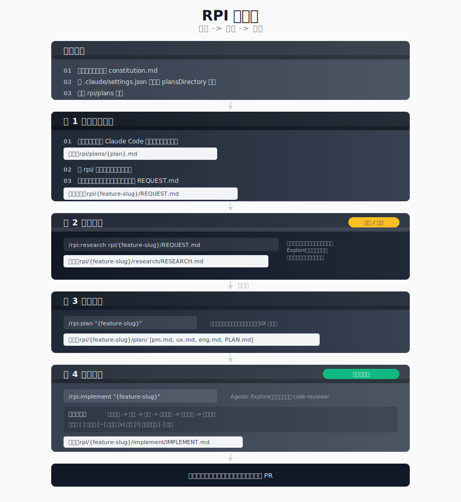

# RPI 工作流

**RPI** = **R**esearch → **P**lan → **I**mplement

这是一个在每个阶段都设置验证闸门的系统化开发工作流。它能避免把时间浪费在不可行的功能上，并确保文档完整。

<table width="100%">
<tr>
<td><a href="../../">← 返回 Claude Code Best Practice</a></td>
<td align="right"></td>
</tr>
</table>

---

## 概览



---

## 安装

将 `.claude` 文件夹（包含 `agents/` 与 `commands/rpi/`）复制到你的仓库根目录，然后创建 `rpi/plans` 目录。

---

## 工作流示例

### 功能：用户认证

**步骤 1：描述**
```text
用户："Add OAuth2 authentication with Google and GitHub providers"

1. Claude 生成计划
   → 输出：rpi/plans/oauth2-authentication.md
2. 创建功能目录：rpi/oauth2-authentication/
3. 将计划复制到该功能目录中
4. 把计划重命名为 REQUEST.md
   → 最终：rpi/oauth2-authentication/REQUEST.md
```

**步骤 2：研究**
```bash
/rpi:research rpi/oauth2-authentication/REQUEST.md
```
输出：
- 带分析内容的 `research/RESEARCH.md`
- 结论：**GO**（可行，且与策略一致）

**步骤 3：规划**
```bash
/rpi:plan oauth2-authentication
```
输出：
- `plan/pm.md` - 用户故事与验收标准
- `plan/ux.md` - 登录界面流程
- `plan/eng.md` - 技术架构
- `plan/PLAN.md` - 3 个阶段、15 个任务

**步骤 4：实施**
```bash
/rpi:implement oauth2-authentication
```
进度：
- 阶段 1：后端基础 → PASS
- 阶段 2：前端集成 → PASS
- 阶段 3：测试与打磨 → PASS

结果：功能完成，可提交 PR。

---

## 功能目录结构

所有功能工作都放在 `rpi/{feature-slug}/` 下：

```text
rpi/{feature-slug}/
├── REQUEST.md              # 步骤 1：初始功能描述
├── research/
│   └── RESEARCH.md         # 步骤 2：GO/NO-GO 分析
├── plan/
│   ├── PLAN.md             # 步骤 3：实施路线图
│   ├── pm.md               # 产品需求
│   ├── ux.md               # UX 设计
│   └── eng.md              # 技术规格
└── implement/
    └── IMPLEMENT.md        # 步骤 4：实施记录
```

---

## 代理与命令

| 命令 | 使用的代理 |
|------|------------|
| `/rpi:research` | requirement-parser、product-manager、Explore、senior-software-engineer、technical-cto-advisor、documentation-analyst-writer |
| `/rpi:plan` | senior-software-engineer、product-manager、ux-designer、documentation-analyst-writer |
| `/rpi:implement` | Explore、senior-software-engineer、code-reviewer |
