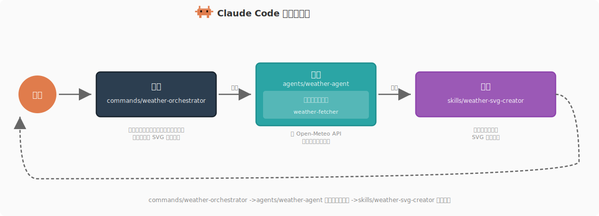

# 命令实现


<table width="100%">
<tr>
<td><a href="../">← 返回 Claude Code Best Practice</a></td>
<td align="right"></td>
</tr>
</table>

---

<a href="#weather-orchestrator"></a>

该仓库将天气编排命令实现为 **Command → Agent → Skill** 架构模式的入口点，用来展示命令如何编排多步骤工作流。

---

## Weather Orchestrator

**文件**： [`.claude/commands/weather-orchestrator.md`](../.claude/commands/weather-orchestrator.md)

```yaml
---
description: Fetch weather data for Dubai and create an SVG weather card
model: haiku
---

# Weather Orchestrator Command

Fetch the current temperature for Dubai, UAE and create a visual SVG weather card.

## Workflow

### Step 1: Ask User Preference
Use the AskUserQuestion tool to ask the user whether they want the temperature
in Celsius or Fahrenheit.

### Step 2: Fetch Weather Data
Use the Agent tool to invoke the weather agent:
- subagent_type: weather-agent
- prompt: Fetch the current temperature for Dubai, UAE in [unit]...

### Step 3: Create SVG Weather Card
Use the Skill tool to invoke the weather-svg-creator skill:
- skill: weather-svg-creator

...
```

该命令负责整个工作流的编排：先询问用户偏好的温度单位，再通过 Agent 工具调用 `weather-agent`，最后通过 Skill 工具调用 `weather-svg-creator` 技能。

---

## 

```bash
$ claude
> /weather-orchestrator
```

---

## 

你可以直接让 Claude 帮你创建，它会在 `.claude/commands/<name>.md` 中生成带 YAML frontmatter 和正文的 Markdown 文件。

---

<a href="https://github.com/shanraisshan/claude-code-best-practice#orchestration-workflow"></a>

天气编排器是 **Command → Agent → Skill** 编排模式中的 **Command**。它作为入口点，负责处理用户交互（温度单位偏好）、把数据抓取委托给 `weather-agent`，并调用 `weather-svg-creator` 技能生成可视化输出。

<p align="center">
  
</p>

| 组件 | 角色 | 本仓库中的实现 |
|------|------|----------------|
| **Command** | 入口点、用户交互 | [`/weather-orchestrator`](../.claude/commands/weather-orchestrator.md) |
| **Agent** | 使用预加载技能获取数据（Agent 技能） | [`weather-agent`](../.claude/agents/weather-agent.md) 搭配 [`weather-fetcher`](../.claude/skills/weather-fetcher/SKILL.md) |
| **Skill** | 独立创建输出（技能） | [`weather-svg-creator`](../.claude/skills/weather-svg-creator/SKILL.md) |
