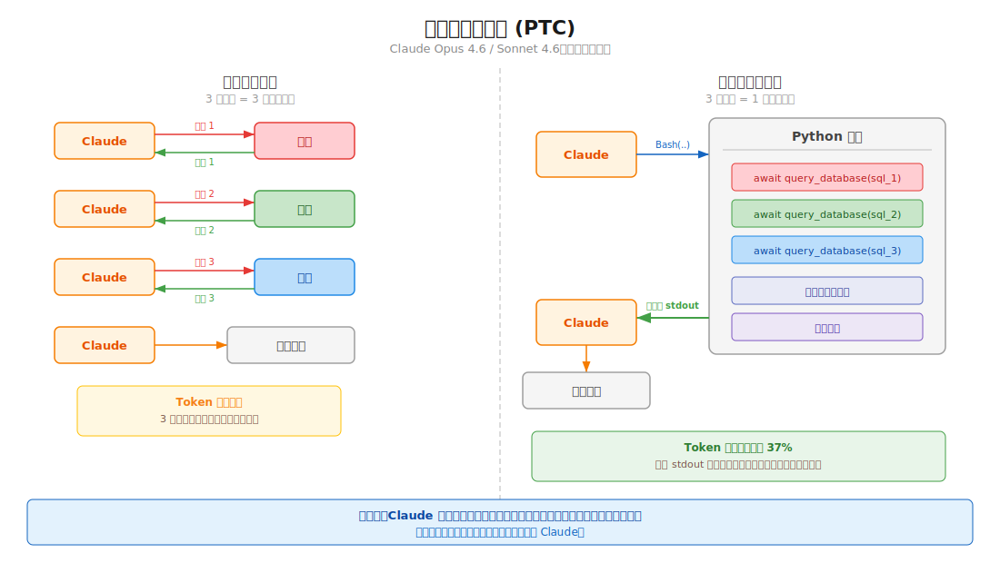

# Claude 楂樼骇宸ュ叿璋冪敤妯″紡

杩欑瘒鎶ュ憡鎬荤粨浜?Claude API 灞傚凡缁忚繘鍏?GA 鐨勫嚑椤归珮绾у伐鍏疯皟鐢ㄨ兘鍔涖€傚畠浠殑鍏卞悓鐩爣鏄細

- 闄嶄綆 token 娑堣€?- 鍑忓皯寤惰繜
- 鎻愰珮宸ュ叿璋冪敤鍑嗙‘鐜?
杩欎簺鑳藉姏涓?Opus / Sonnet 4.6 涓€鍚屽彂甯冦€?
<table width="100%">
<tr>
<td><a href="../">鈫?杩斿洖 Claude Code Best Practice</a></td>
<td align="right"></td>
</tr>
</table>

## 鐩綍

1. [姒傝](#姒傝)
2. [Programmatic Tool Calling](#programmatic-tool-calling)
3. [Web Search / Fetch 鐨勫姩鎬佽繃婊(#web-search--fetch-鐨勫姩鎬佽繃婊?
4. [Tool Search Tool](#tool-search-tool)
5. [宸ュ叿璋冪敤绀轰緥](#宸ュ叿璋冪敤绀轰緥)
6. [涓?Claude Code 鐨勫叧绯籡(#涓?claude-code-鐨勫叧绯?

---

## 姒傝

| 鐗规€?| 瑙ｅ喅鐨勯棶棰?| Token 鑺傜渷 | 鍙敤鑼冨洿 |
|------|------------|------------|----------|
| Programmatic Tool Calling | 澶氭宸ュ叿寰幆浼氬湪寰€杩斾腑娴垂澶ч噺 token | 绾?37% | API銆丗oundry锛圙A锛?|
| Dynamic Filtering | Web 鎼滅储缁撴灉鎶婂ぇ閲忔棤鍏冲唴瀹瑰杩涗笂涓嬫枃 | 杈撳叆 token 骞冲潎鍑忓皯绾?24% | API銆丗oundry锛圙A锛?|
| Tool Search Tool | 宸ュ叿瀹氫箟杩囧锛岀郴缁熸彁绀鸿繃閲?| 绾?85% | API銆丗oundry锛圙A锛?|
| Tool Use Examples | Schema 鍙兘瀹氫箟缁撴瀯锛岄毦浠ヨ〃杈剧敤娉曟ā寮?| 鍑嗙‘鐜囦粠 72% 鎻愬崌鍒?90% | API銆丗oundry锛圙A锛?|

杩欎簺鑳藉姏鍦?**2026-02-18** 鏃堕兘宸茬粡杩涘叆閫氱敤鍙敤鐘舵€併€?
鏇村疄鐢ㄧ殑鐞嗚В鏂瑰紡鏄細

- 宸ュ叿瀹氫箟澶锛屽氨鍏堜笂 **Tool Search**
- 涓棿缁撴灉澶ぇ锛屽氨鑰冭檻 **Programmatic Tool Calling**
- Web 缁撴灉澶剰锛屽氨鐢?**Dynamic Filtering**
- 鍙傛暟鑰佸～閿欙紝灏辫ˉ **Tool Use Examples**

---

## Programmatic Tool Calling



### 瀹冨埌搴曟敼鍙樹簡浠€涔?
#### 浼犵粺宸ュ叿璋冪敤

```text
鐢ㄦ埛闂 -> Claude -> 宸ュ叿 1 -> Claude -> 宸ュ叿 2 -> Claude -> 宸ュ叿 3 -> Claude -> 鏈€缁堝洖绛?```

姣忚皟涓€娆″伐鍏凤紝妯″瀷閮借鍐嶈窇涓€杞€?
#### Programmatic Tool Calling

```text
鐢ㄦ埛闂 -> Claude -> 鍐欎竴娈?Python -> Python 鍐呴儴璋冪敤澶氫釜宸ュ叿 -> 杈撳嚭 stdout -> Claude -> 鏈€缁堝洖绛?```

鏍稿績鍙樺寲鏄細

- Claude 涓嶅啀閫愭鎵嬪姩璋冨伐鍏?- 鑰屾槸鍏堝啓浠ｇ爜鏉ョ紪鎺掓暣涓伐鍏烽摼
- 鍙湁鏈€缁堣緭鍑鸿繘鍏ユā鍨嬩笂涓嬫枃

鍥犳锛屽師鏉?3 娆″伐鍏峰線杩旓紝鍙兘鍙樻垚 1 娆℃ā鍨嬫帹鐞嗐€?
### 宸ヤ綔鏂瑰紡

1. 浣犳妸宸ュ叿鐨?`allowed_callers` 璁句负 `["code_execution_20250825"]`
2. Claude 鍦ㄦ矙绠遍噷鍐?Python锛屾妸杩欎簺宸ュ叿褰撳紓姝ュ嚱鏁拌皟鐢?3. 浠ｇ爜杩愯鍒板伐鍏疯皟鐢ㄧ偣鏃讹紝娌欑鏆傚仠锛孉PI 杩斿洖涓€涓?`tool_use`
4. 浣犳妸宸ュ叿缁撴灉浼犲洖鍘伙紝缁撴灉杩涘叆鐨勬槸**姝ｅ湪杩愯鐨勪唬鐮?*锛岃€屼笉鏄?Claude 鐨勫璇濅笂涓嬫枃
5. 浠ｇ爜缁х画鎵ц锛屽仛杩囨护銆佽仛鍚堟垨缁х画璋冪敤鍏朵粬宸ュ叿
6. 鏈€缁堝彧鎶?`stdout` 閫佸洖 Claude

### 鍩烘湰閰嶇疆

```json
{
  "tools": [
    {
      "type": "code_execution_20250825",
      "name": "code_execution"
    },
    {
      "name": "query_database",
      "description": "鎵ц SQL 鏌ヨ锛岃繑鍥?JSON銆?,
      "input_schema": {
        "type": "object",
        "properties": {
          "sql": { "type": "string" }
        },
        "required": ["sql"]
      },
      "allowed_callers": ["code_execution_20250825"]
    }
  ]
}
```

### `allowed_callers` 鐨勫惈涔?
| 鍊?| 鍚箟 |
|----|------|
| `["direct"]` | 鍙兘璧颁紶缁熻皟鐢ㄦā寮?|
| `["code_execution_20250825"]` | 鍙兘鍦?Python 娌欑閲岃璋冪敤 |
| `["direct", "code_execution_20250825"]` | 涓ょ妯″紡閮藉彲鐢?|

鏇存帹鑽愮殑鍋氭硶鏄細**姣忎釜宸ュ叿灏介噺鍙繚鐣欎竴绉嶈皟鐢ㄦā寮?*锛岃妯″瀷鍐崇瓥鏇存槑纭€?
### 鍝嶅簲閲岀殑 `caller`

姣忎釜宸ュ叿璋冪敤鍧楅噷閮戒細甯︿竴涓?`caller` 瀛楁锛岀敤浜庡尯鍒嗚皟鐢ㄦ潵婧愶細

```json
{ "caller": { "type": "direct" } }
```

```json
{ "caller": { "type": "code_execution_20250825", "tool_id": "srvtoolu_abc123" } }
```

### 甯歌楂樼骇妯″紡

#### 鎵归噺澶勭悊

```python
regions = ["West", "East", "Central", "North", "South"]
results = {}
for region in regions:
    data = await query_database(f"SELECT SUM(revenue) FROM sales WHERE region='{region}'")
    results[region] = data[0]["revenue"]

top = max(results.items(), key=lambda x: x[1])
print(f"Top region: {top[0]} with ${top[1]:,}")
```

#### 婊¤冻鏉′欢灏辨彁鍓嶇粨鏉?
```python
endpoints = ["us-east", "eu-west", "apac"]
for endpoint in endpoints:
    status = await check_health(endpoint)
    if status == "healthy":
        print(f"Found healthy endpoint: {endpoint}")
        break
```

#### 鏍规嵁涓棿缁撴灉鍔ㄦ€侀€夊伐鍏?
```python
file_info = await get_file_info(path)
if file_info["size"] < 10000:
    content = await read_full_file(path)
else:
    content = await read_file_summary(path)
print(content)
```

#### 鍏堣繃婊わ紝鍐嶈妯″瀷鐪?
```python
logs = await fetch_logs(server_id)
errors = [log for log in logs if "ERROR" in log]
print(f"Found {len(errors)} errors")
for error in errors[-10:]:
    print(error)
```

### 鏀寔鐨勬ā鍨?
| 妯″瀷 | 鏄惁鏀寔 |
|------|----------|
| Claude Opus 4.6 | 鏀寔 |
| Claude Sonnet 4.6 | 鏀寔 |
| Claude Sonnet 4.5 | 鏀寔 |
| Claude Opus 4.5 | 鏀寔 |

### 绾︽潫

| 绾︽潫 | 璇存槑 |
|------|------|
| Bedrock / Vertex | 鐩墠涓嶆敮鎸?|
| MCP 宸ュ叿 | 涓嶈兘鍋氱紪绋嬪紡璋冪敤 |
| Web Search / Fetch | 涓嶈兘鍦?PTC 閲岀洿鎺ヤ娇鐢?|
| Structured Outputs | 涓?`strict: true` 涓嶅吋瀹?|
| 寮哄埗 tool_choice | 涓嶈兘寮哄埗璧?PTC |
| 瀹瑰櫒鐢熷懡鍛ㄦ湡 | 澶х害 4.5 鍒嗛挓 |
| ZDR | 涓嶅湪 Zero Data Retention 瑕嗙洊鑼冨洿 |
| 宸ュ叿缁撴灉瀹夊叏 | 澶栭儴缁撴灉浼氫互瀛楃涓插舰寮忚繘鍏ヤ唬鐮侊紝娉ㄦ剰浠ｇ爜娉ㄥ叆椋庨櫓 |

### 閫傚悎浠€涔堝満鏅?
| 閫傚悎 | 涓嶅お閫傚悎 |
|------|----------|
| 澶ф暟鎹粨鏋滆仛鍚?| 鍙湁涓€娆＄畝鍗曞伐鍏疯皟鐢?|
| 3 娆′互涓婁覆鑱斿伐鍏?| 闇€瑕佸嵆鏃剁敤鎴峰弽棣堢殑浜や簰 |
| 鍏堣繃婊ゅ啀浜ょ粰妯″瀷 | 鐗瑰埆杞荤殑灏忔搷浣?|
| 閽堝寰堝瀵硅薄鍋氬苟琛屽鐞?| |
| 鏍规嵁涓棿缁撴灉鍒嗘敮鎵ц | |

### Token 鏁堢巼

鏈€鍏抽敭鐨勪竴鐐规槸锛?
- 缂栫▼寮忓伐鍏疯皟鐢ㄤ骇鐢熺殑涓棿缁撴灉**涓嶄細杩涘叆 Claude 涓婁笅鏂?*
- 杩涘叆涓婁笅鏂囩殑閫氬父鍙湁鏈€缁?`stdout`

鎵€浠ュ鏋滀綘杩炵画璋冪敤 10 涓伐鍏凤紝PTC 鐨?token 娑堣€楅€氬父浼氳繙浣庝簬浼犵粺 10 娆″線杩斻€?
---

## Web Search / Fetch 鐨勫姩鎬佽繃婊?
### 闂鏄粈涔?
Web Search 鍜?Web Fetch 鏈€澶х殑闂涓嶆槸鈥滄壘涓嶅埌淇℃伅鈥濓紝鑰屾槸鈥滄壘鍒板お澶氭棤鍏充俊鎭€濄€?
鍘熷 HTML 浼氭妸浠ヤ笅鍐呭涓€鑲¤剳濉炶繘涓婁笅鏂囷細

- 瀵艰埅鏍?- 骞垮憡
- 椤佃剼
- 甯冨眬鏍锋澘
- 涓庨棶棰樻棤鍏崇殑澶ч噺鏂囨湰

杩欎笉浠呮氮璐?token锛屼篃浼氶檷浣庢ā鍨嬪垽鏂川閲忋€?
### 瑙ｅ喅鏂瑰紡

Claude 浼氬厛鍐欏苟鎵ц涓€娈?Python锛屽缃戦〉缁撴灉鍋氶澶勭悊锛屽彧鎶婄湡姝ｇ浉鍏崇殑鍐呭绛涜繘涓婁笅鏂囥€?
#### 浠ュ墠

```text
鏌ヨ -> 鎼滅储缁撴灉 -> 鎶撳彇鏁撮〉 HTML -> 鍏ㄩ儴濉炶繘涓婁笅鏂?-> Claude 鍐嶅鐞?```

#### 鐜板湪

```text
鏌ヨ -> 鎼滅储缁撴灉 -> Claude 鍐欒繃婊や唬鐮?-> 杩囨护鍑虹浉鍏充俊鎭?-> 鍐嶈繘鍏ヤ笂涓嬫枃
```

### API 閰嶇疆

```json
{
  "model": "claude-opus-4-6",
  "max_tokens": 4096,
  "tools": [
    { "type": "web_search_20260209", "name": "web_search" },
    { "type": "web_fetch_20260209", "name": "web_fetch" }
  ]
}
```

闇€瑕侀厤鍚堣姹傚ご锛?
```text
anthropic-beta: code-execution-web-tools-2026-02-09
```

褰撲娇鐢ㄦ柊鐗堝伐鍏风被鍨嬪苟鎼厤 Sonnet 4.6 / Opus 4.6 鏃讹紝杩欓」鑳藉姏榛樿寮€鍚€?
### 鍩哄噯缁撴灉

#### BrowseComp

| 妯″瀷 | 鏃犺繃婊?| 寮€鍚繃婊?| 鎻愬崌 |
|------|--------|----------|------|
| Sonnet 4.6 | 33.3% | **46.6%** | +13.3 涓櫨鍒嗙偣 |
| Opus 4.6 | 45.3% | **61.6%** | +16.3 涓櫨鍒嗙偣 |

#### DeepsearchQA

| 妯″瀷 | 鏃犺繃婊?| 寮€鍚繃婊?| 鎻愬崌 |
|------|--------|----------|------|
| Sonnet 4.6 | 52.6% | **59.4%** | +6.8 涓櫨鍒嗙偣 |
| Opus 4.6 | 69.8% | **77.3%** | +7.5 涓櫨鍒嗙偣 |

骞冲潎杩樺彲浠ュ噺灏戠害 **24% 鐨勮緭鍏?token**銆?
### 鍏稿瀷閫傜敤鍦烘櫙

- 缈绘妧鏈枃妗?- 璺ㄦ潵婧愭牳瀵瑰紩鐢?- 澶氶〉闈氦鍙夋悳绱?- 澶氭楠よ皟鐮旈棶棰?- 浠庤秴闀跨綉椤甸噷鎶藉彇鐗瑰畾鏁版嵁鐐?
---

## Tool Search Tool

### 闂鏄粈涔?
濡傛灉浣犱竴寮€濮嬪氨鎶婃墍鏈夊伐鍏峰畾涔夐兘鏀捐繘涓婁笅鏂囷紝鎴愭湰浼氬緢楂樸€?
渚嬪锛?
- 50 涓?MCP 宸ュ叿
- 姣忎釜宸ュ叿瀹氫箟 1.5k token
- 杩樻病寮€濮嬮棶闂锛屽厜宸ュ叿璇存槑灏卞凡缁忓悆鎺?75k token

### 瑙ｅ喅鏂瑰紡

缁欎笉甯哥敤宸ュ叿鏍囪锛?
```json
"defer_loading": true
```

杩欐牱杩欎簺宸ュ叿涓嶄細鍦ㄥ垵濮嬩笂涓嬫枃涓睍寮€锛岃€屾槸鐢?Claude 閫氳繃 Tool Search 鎸夐渶鍙戠幇銆?
### 閰嶇疆绀轰緥

```json
{
  "tools": [
    {
      "type": "mcp_toolset",
      "mcp_server_name": "google-drive",
      "default_config": { "defer_loading": true },
      "configs": {
        "search_files": { "defer_loading": false }
      }
    }
  ]
}
```

### 鏈€浣冲疄璺?
- 甯哥敤鐨?3 鍒?5 涓伐鍏峰父椹诲姞杞?- 鍏朵綑宸ュ叿寤惰繜鍔犺浇
- 宸ュ叿鍚嶇О鍜屾弿杩拌鍐欐竻妤氾紝鍥犱负鎼滅储渚濊禆杩欎簺鏂囨湰
- 鍦?system prompt 閲岃鏄庘€滄湁鍝簺鑳藉姏鍙寜闇€鍙戠幇鈥?
### 浠€涔堟椂鍊欏€煎緱鐢?
- 宸ュ叿瀹氫箟瓒呰繃 10k token
- 宸ュ叿鏁伴噺杈惧埌 10 涓互涓?- 鏈夊涓?MCP 鏈嶅姟鍣?- 宸ュ叿澶瀵艰嚧妯″瀷閫夐敊宸ュ叿

### 鑺傜渷鏁堟灉

Anthropic 鐨?benchmark 涓紝宸ュ叿瀹氫箟 token 鍙噺灏戠害 **85%**銆?
### Claude Code 瀵瑰簲鑳藉姏

Claude Code 鑷甫 **MCP tool search auto mode**銆備粠 v2.1.7 寮€濮嬮粯璁ゅ惎鐢ㄣ€?
褰?MCP 宸ュ叿鎻忚堪鍗犱笂涓嬫枃瓒呰繃 10% 鏃讹細

- 绯荤粺浼氬欢杩熷姞杞藉畠浠?- 鍐嶉€氳繃 `MCPSearch` 鎸夐渶鍙戠幇

鍙互鐢ㄤ笅闈㈢殑鐜鍙橀噺璋冮槇鍊硷細

```bash
ENABLE_TOOL_SEARCH=auto:N
```

鍏朵腑 `N` 鏄笂涓嬫枃鐧惧垎姣旈槇鍊笺€?
---

## 宸ュ叿璋冪敤绀轰緥

### 闂鏄粈涔?
JSON Schema 鍙兘瀹氫箟锛?
- 瀛楁绫诲瀷
- 蹇呭～椤?- 缁撴瀯灞傜骇

浣嗗畠琛ㄨ揪涓嶄簡涓嬮潰杩欎簺淇℃伅锛?
- 鍙€夊弬鏁颁粈涔堟椂鍊欒濉?- 鍝簺鍙傛暟缁勫悎鎵嶅悎鐞?- 鏃ユ湡銆両D銆佸懡鍚嶇殑鎯緥
- 宓屽缁撴瀯搴旇濡備綍瀹為檯浣跨敤

### 瑙ｅ喅鏂瑰紡

缁欏伐鍏疯ˉ涓?`input_examples`锛岃妯″瀷鐪嬪埌鐪熷疄鐢ㄦ硶銆?
### 绀轰緥

```json
{
  "name": "create_ticket",
  "description": "鍒涘缓鏀寔宸ュ崟",
  "input_schema": {
    "type": "object",
    "properties": {
      "title": { "type": "string" },
      "priority": { "type": "string", "enum": ["low", "medium", "high", "critical"] },
      "assignee": { "type": "string" },
      "labels": { "type": "array", "items": { "type": "string" } }
    },
    "required": ["title"]
  },
  "input_examples": [
    {
      "title": "鐧诲綍椤佃繑鍥?500",
      "priority": "critical",
      "assignee": "oncall-team",
      "labels": ["bug", "auth", "production"]
    },
    {
      "title": "澧炲姞娣辫壊妯″紡鏀寔",
      "priority": "low",
      "labels": ["feature-request", "ui"]
    },
    {
      "title": "鏇存柊 v2 API 鏂囨。"
    }
  ]
}
```

### 鏈€浣冲疄璺?
- 鐢ㄧ湡瀹炴暟鎹紝涓嶈鍙啓 `example_value`
- 鍚屾椂灞曠ず鏈€灏忋€侀儴鍒嗐€佸畬鏁翠笁绉嶇敤娉?- 姣忎釜宸ュ叿 1 鍒?5 涓緥瀛愰€氬父灏卞
- 浼樺厛瑙ｅ喅姝т箟锛岃€屼笉鏄爢婊＄ず渚?- 鎶婂弬鏁扮浉鍏虫€хず鑼冩竻妤?
Anthropic 鐨勫熀鍑嗘樉绀猴紝杩欑被绀轰緥鍙互鎶婂鏉傚弬鏁板鐞嗗噯纭巼浠?**72% 鎷夊埌 90%**銆?
---

## 涓?Claude Code 鐨勫叧绯?
### 瀵?Claude Code 鐢ㄦ埛鏈€鐩存帴鐩稿叧鐨勯儴鍒?
| 鐗规€?| Claude Code 鐘舵€?| 寤鸿 |
|------|------------------|------|
| Tool Search | 宸插唴寤猴紝鑷?v2.1.7 璧烽粯璁ゅ紑鍚?| 濡傛灉 MCP 宸ュ叿寰堝锛屽彲浠ヨ皟 `ENABLE_TOOL_SEARCH=auto:N` |
| Dynamic Filtering | CLI 鏆備笉鍙洿鎺ラ厤缃?| 瀵?Agent SDK 鍋?Web 璋冪爺鏇存湁甯姪 |
| PTC | CLI 鏆備笉寮€鏀?| 鏇撮€傚悎鑷畾涔?Agent SDK 宸ヤ綔娴?|
| Tool Use Examples | CLI 涓嶇洿鎺ユ毚闇?| 鏇撮€傚悎鑷畾涔?MCP 鏈嶅姟浣滆€?|

### 瀵?Agent SDK 寮€鍙戣€?
濡傛灉浣犳鍦ㄧ敤 `@anthropic-ai/claude-agent-sdk` 鏋勫缓 agent锛孭TC 鏄渶鍊煎緱绔嬪埢灏濊瘯鐨勮兘鍔涗箣涓€锛?
1. 鍦?tools 鏁扮粍閲屽姞鍏?`code_execution_20250825`
2. 缁欓€傚悎鎵瑰鐞嗗拰杩囨护鐨勫伐鍏疯缃?`allowed_callers`
3. 瀹炵幇鈥滄殏鍋?-> 娉ㄥ叆宸ュ叿缁撴灉 -> 鎭㈠杩愯鈥濈殑寰幆
4. 璁╁伐鍏峰敖閲忚繑鍥炵粨鏋勫寲 JSON锛屾柟渚?Python 閲屽鐞?
### 瀵?MCP 鏈嶅姟鍣ㄤ綔鑰?
濡傛灉浣犲湪鍐欒嚜瀹氫箟 MCP 鏈嶅姟鍣紝`input_examples` 浼氬緢鏈夊府鍔╋細

- 鍦?schema 涔嬪琛ュ厖鐪熷疄鐢ㄦ硶
- 鍦?description 涓妸杩斿洖鏍煎紡璇存竻妤?- 濡傛灉宸ュ叿浠ュ悗鍙兘鎺ュ叆 PTC锛岀粨鏋勫寲杈撳嚭浼氭洿閲嶈

---

## 璧勬枡鏉ユ簮

- [Anthropic Engineering: Advanced Tool Use](https://www.anthropic.com/engineering/advanced-tool-use)
- [Programmatic Tool Calling Documentation](https://platform.claude.com/docs/en/agents-and-tools/tool-use/programmatic-tool-calling)
- [Code Execution Tool Documentation](https://platform.claude.com/docs/en/agents-and-tools/tool-use/code-execution-tool)
- [Improved Web Search with Dynamic Filtering](https://claude.com/blog/improved-web-search-with-dynamic-filtering)

