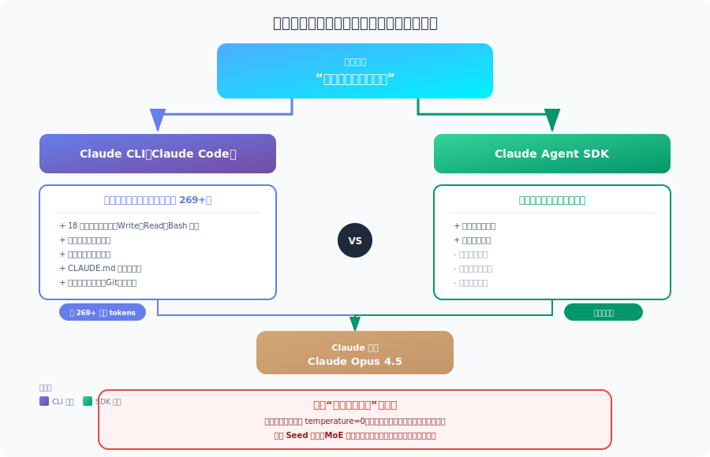

# Claude Agent SDK 涓?Claude CLI锛氱郴缁熸彁绀鸿瘝鍜岃緭鍑轰竴鑷存€?
<table width="100%">
<tr>
<td><a href="../">鈫?杩斿洖 Claude Code Best Practice</a></td>
<td align="right"></td>
</tr>
</table>



---

## 鎵ц鎽樿

褰撲綘鎶婂悓涓€鍙ヨ瘽锛屼緥濡?鈥淲hat is the capital of Norway?鈥濓紝鍒嗗埆鍙戠粰锛?
- **Claude Agent SDK**
- **Claude CLI锛圕laude Code锛?*

杩欎袱涓叆鍙ｅ疄闄呴檮甯︾殑 system prompt 骞朵笉涓€鏍枫€?
Claude CLI 浣跨敤鐨勬槸涓€濂?*妯″潡鍖栫郴缁熸彁绀烘灦鏋?*锛?
- 鍩虹鎻愮ず澶х害 269 tokens
- 鍐嶆寜鍔熻兘鎸夐渶鎷兼帴棰濆鍐呭

鑰?Agent SDK 榛樿鎯呭喌涓嬪彧甯︿竴涓?*闈炲父绮剧畝鐨勬彁绀?*銆?
鍥犳锛屽嵆浣跨敤鎴疯緭鍏ョ浉鍚岋紝涔?*涓嶈兘淇濊瘉涓よ竟杈撳嚭瀹屽叏涓€鑷?*銆傚嵆渚夸綘鎶婇厤缃敖閲忓榻愶紝Claude 涔熸病鏈夋彁渚?seed 鍙傛暟锛屽簳灞傛帹鐞嗘湰韬氨涓嶆槸瀹屽叏纭畾鎬х殑銆?
---

## 1. System Prompt 瀵规瘮

### Claude CLI锛圕laude Code锛?
Claude CLI 浣跨敤鐨勬槸**妯″潡鍖?system prompt 鏋舵瀯**锛屽熀纭€ prompt 澶х害 269 tokens锛岄殢鍚庢牴鎹姛鑳藉姩鎬佸姞杞借ˉ鍏呭唴瀹广€?
| 缁勪欢 | 璇存槑 | 鍔犺浇鏂瑰紡 |
|------|------|----------|
| **鍩虹 System Prompt** | 鏍稿績琛屼负涓庡熀纭€绾︽潫 | 濮嬬粓鍔犺浇 |
| **宸ュ叿璇存槑** | 18+ 鍐呭缓宸ュ叿锛屽 Write銆丷ead銆丒dit銆丅ash 绛?| 濮嬬粓鍔犺浇 |
| **缂栫爜瑙勮寖** | 椋庢牸銆佹牸寮忋€佸畨鍏ㄥ疄璺?| 濮嬬粓鍔犺浇 |
| **瀹夊叏瑙勫垯** | 鎷掔瓟銆佹敞鍏ラ槻寰°€侀闄╅檺鍒?| 濮嬬粓鍔犺浇 |
| **鍝嶅簲椋庢牸** | 璇皵銆佽缁嗙▼搴︺€佽В閲婃繁搴︾瓑 | 濮嬬粓鍔犺浇 |
| **鐜涓婁笅鏂?* | 宸ヤ綔鐩綍銆乬it 鐘舵€併€佸钩鍙颁俊鎭?| 濮嬬粓鍔犺浇 |
| **椤圭洰涓婁笅鏂?* | CLAUDE.md銆乻ettings銆乭ooks 绛?| 鏉′欢鍔犺浇 |
| **Subagent Prompt** | Plan mode銆丒xplore agent銆乀ask agent 绛?| 鏉′欢鍔犺浇 |
| **瀹夊叏瀹℃煡鎵╁睍** | 鏇撮暱鐨勫畨鍏ㄧ害鏉熸钀?| 鏉′欢鍔犺浇 |

瀹冪殑鐗圭偣鏄細

- prompt 缁撴瀯寰堟ā鍧楀寲
- 浼氳嚜鍔ㄥ姞杞藉伐浣滅洰褰曚腑鐨?`CLAUDE.md`
- 鏈夋洿瀹屾暣鐨勫畨鍏ㄤ笌娉ㄥ叆闃插尽灞?- 鍦ㄤ氦浜掑紡妯″紡閲岃繕浼氭寔缁繚鐣欎細璇濅笂涓嬫枃

### Claude Agent SDK

Agent SDK 榛樿浣跨敤鐨勬槸鏇磋交閲忕殑 system prompt锛岄€氬父鍙寘鍚細

| 缁勪欢 | 璇存槑 | token 褰卞搷 |
|------|------|-----------|
| **蹇呰宸ュ叿璇存槑** | 浠呬綘鏄惧紡鎻愪緵鐨勫伐鍏?| 寰堝皬 |
| **鍩虹瀹夊叏璇存槑** | 鏈€灏忓寲鐨勫畨鍏ㄧ害鏉?| 寰堝皬 |

鍏堕粯璁ょ壒鐐规槸锛?
- 涓嶅甫瀹屾暣缂栫爜瑙勮寖
- 涓嶅甫椤圭洰涓婁笅鏂?- 涓嶈嚜鍔ㄥ甫涓婂ぇ閲忓伐鍏峰畾涔?- 鎯虫帴杩?CLI 琛屼负锛屽繀椤绘樉寮忛厤缃?
---

## 2. 涓や釜鍏ュ彛鍒嗗埆浼氬彂閫佷粈涔?
### 绀轰緥锛歚What is the capital of Norway?`

#### 閫氳繃 Claude CLI

```text
System Prompt:
- 鍩虹绯荤粺鎻愮ず
- 宸ュ叿璇存槑锛圵rite / Read / Edit / Bash / Grep / Glob 绛夛級
- Git 瀹夊叏绾︽潫
- 浠ｇ爜寮曠敤瑙勮寖
- 涓撲笟涓庡瑙傛€ц姹?- 瀹夊叏涓庢敞鍏ラ槻寰¤鍒?- 鐜涓婁笅鏂囷紙绯荤粺銆佺洰褰曘€佹棩鏈燂級
- CLAUDE.md锛堣嫢瀛樺湪锛?- MCP 宸ュ叿璇存槑锛堣嫢鍚敤锛?- Plan / Explore 妯″紡鎻愮ず锛堣嫢鍚敤锛?- 褰撳墠浼氳瘽涓婁笅鏂?
User Message:
"What is the capital of Norway?"
```

#### 閫氳繃 Agent SDK锛堥粯璁わ級

```text
System Prompt:
- 蹇呰宸ュ叿璇存槑锛堝鏋滀綘浼犱簡宸ュ叿锛?- 鏈€鍩虹鐨勮繍琛屼笂涓嬫枃

User Message:
"What is the capital of Norway?"
```

#### 閫氳繃 Agent SDK锛堜娇鐢?`claude_code` preset锛?
```ts
const response = await query({
  prompt: "What is the capital of Norway?",
  options: {
    systemPrompt: {
      type: "preset",
      preset: "claude_code"
    }
  }
});
```

杩欐椂 system prompt 浼氭洿鎺ヨ繎 CLI锛?
- 鍖呭惈瀹屾暣 Claude Code 鎻愮ず
- 鍖呭惈宸ュ叿璇存槑
- 鍖呭惈缂栫爜瑙勮寖
- 鍖呭惈瀹夊叏瑙勫垯

浣嗕粛瑕佹敞鎰忥細

- **瀹冮粯璁よ繕鏄笉浼氳嚜鍔ㄦ妸椤圭洰 `CLAUDE.md` 甯﹁繘鏉?*
- 闄ら潪浣犲啀棰濆閰嶇疆 `settingSources`

---

## 3. 鍙畾鍒舵柟寮?
### Claude CLI 鐨勫畾鍒舵柟寮?
| 鏂规硶 | 鍛戒护 | 浣滅敤 |
|------|------|------|
| 杩藉姞绯荤粺鎻愮ず | `--append-system-prompt` | 淇濈暀榛樿 prompt锛屽啀棰濆杩藉姞 |
| 鐩存帴鏇挎崲 | `--system-prompt` | 瀹屽叏鏇挎崲榛樿 prompt |
| 椤圭洰涓婁笅鏂?| `CLAUDE.md` | 鑷姩鍔犺浇锛屼笖鍏峰鎸佺画鎬?|
| 杈撳嚭椋庢牸 | `/output-style [name]` | 浣跨敤棰勫畾涔夊搷搴旈鏍?|

### Agent SDK 鐨勫畾鍒舵柟寮?
| 鏂规硶 | 閰嶇疆 | 浣滅敤 |
|------|------|------|
| 鑷畾涔?prompt | `systemPrompt: "..."` | 鐩存帴鏇挎崲榛樿鍊?|
| 棰勮 + 杩藉姞 | `preset: "claude_code", append: "..."` | 淇濈暀 CLI 鑳藉姏骞惰拷鍔犺嚜瀹氫箟瑕佹眰 |
| 鍔犺浇 CLAUDE.md | `settingSources: ["project"]` | 鍔犺浇椤圭洰绾ч厤缃?|
| 鍔犺浇杈撳嚭椋庢牸 | `settingSources: ["user"]` 鎴?`["project"]` | 鍔犺浇宸蹭繚瀛橀鏍?|

### 閰嶇疆鏁堟灉瀵圭収

| 鑳藉姏 | CLI 榛樿 | SDK 榛樿 | SDK + Preset |
|------|----------|----------|--------------|
| 宸ュ叿璇存槑 | 瀹屾暣 | 寰堝皯 | 瀹屾暣 |
| 缂栫爜瑙勮寖 | 鏈?| 娌℃湁 | 鏈?|
| 瀹夊叏瑙勫垯 | 瀹屾暣 | 鍩虹 | 瀹屾暣 |
| 鑷姩鍔犺浇 CLAUDE.md | 鏈?| 娌℃湁 | 娌℃湁 |
| 鑷姩椤圭洰涓婁笅鏂?| 鏈?| 娌℃湁 | 娌℃湁 |

濡傛灉瑕佽 SDK 鏇存帴杩?CLI锛岄€氬父杩橀渶瑕侊細

```ts
settingSources: ["project"]
```

---

## 4. 杈撳嚭涓€鑷存€ц兘涓嶈兘淇濊瘉

### 鍏抽敭缁撹锛氫笉鑳?
Claude Messages API **娌℃湁 seed 鍙傛暟**銆傝繖鎰忓懗鐫€灏辩畻浣犲敖鍔涙妸鍙傛暟瀵归綈锛屼篃涓嶈兘瑕佹眰瀹冧骇鐢熼€愬瓧涓€鑷磋緭鍑恒€?
### 浼氱牬鍧忎竴鑷存€х殑鍥犵礌

| 鍥犵礌 | 璇存槑 | 鑳芥帶鍒跺悧 |
|------|------|----------|
| 榛樿 system prompt 涓嶅悓 | CLI 涓?SDK 鐨勯粯璁ら厤缃氨涓嶅悓 | 閮ㄥ垎鍙帶 |
| 娴偣杩愮畻宸紓 | 骞惰纭欢浼氬甫鏉ョ粏灏忓樊寮?| 涓嶅彲鎺?|
| MoE 璺敱 | 涓嶅悓璇锋眰鍙兘钀藉埌涓嶅悓涓撳璺緞 | 涓嶅彲鎺?|
| 鎵瑰鐞嗕笌璋冨害 | 浜戠鍩虹璁炬柦璋冨害涓嶅悓 | 涓嶅彲鎺?|
| 鏁板€肩簿搴?| 鎺ㄧ悊寮曟搸瀹炵幇瀛樺湪宸紓 | 涓嶅彲鎺?|
| 妯″瀷蹇収 | 鍘傚晢鏇存柊鎴栧垏鎹㈠埆鍚?| 涓嶅彲鎺?|

### `temperature=0` 涔熶笉浠ｈ〃缁濆涓€鑷?
灏辩畻璁剧疆浜嗚椽蹇冭В鐮侊細

- 涔熸棤娉曚繚璇佸畬鍏ㄧ‘瀹氭€?- 渚濇棫鍙兘鏈夊皬骞呭彉鍖?- 杩欎笉鏄?CLI 鐙湁闂锛岃€屾槸鐜颁唬澶фā鍨嬫湇鍔＄殑閫氱梾

---

## 5. 鎬庢牱灏介噺璁╀袱杈规洿鎺ヨ繎

### Agent SDK 渚?
```ts
import Anthropic from "@anthropic-ai/sdk";

const client = new Anthropic();

const response = await client.messages.create({
  model: "claude-sonnet-4-20250514",
  max_tokens: 1024,
  temperature: 0,
  system: "涓?CLI 灏介噺涓€鑷寸殑绯荤粺鎻愮ず",
  messages: [
    { role: "user", content: "What is the capital of Norway?" }
  ]
});
```

鎴栬€呯敤 Agent SDK 鏌ヨ鎺ュ彛锛?
```ts
import { query } from "@anthropic-ai/agent-sdk";

for await (const message of query({
  prompt: "What is the capital of Norway?",
  options: {
    systemPrompt: {
      type: "preset",
      preset: "claude_code"
    },
    temperature: 0,
    model: "claude-sonnet-4-20250514",
    settingSources: ["project"]
  }
})) {
  // 澶勭悊鍝嶅簲
}
```

### CLI 渚?
```bash
claude -p "What is the capital of Norway?" \
  --model claude-sonnet-4-20250514 \
  --temperature 0
```

### 浣嗕緷鏃ц鎺ュ彈涓€涓簨瀹?
灏辩畻浣狅細

- 妯″瀷瀹屽叏涓€鑷?- temperature 涓€鑷?- system prompt 灏介噺涓€鑷?- project settings 涔熶竴鑷?
涔?*浠嶇劧涓嶈兘鑾峰緱鐪熸鐨勪綅绾т竴鑷磋緭鍑?*銆?
---

## 6. 瀹為檯宸ョ▼鍚箟

### 浠€涔堟椂鍊欑敤鍝釜鍏ュ彛

| 鍦烘櫙 | 鎺ㄨ崘鍏ュ彛 | 鍘熷洜 |
|------|----------|------|
| 浜や簰寮忓紑鍙?| Claude CLI | 宸ュ叿榻愬叏锛岄」鐩笂涓嬫枃澶╃劧涓板瘜 |
| 绋嬪簭鍖栭泦鎴?| Agent SDK | 鎺у埗绮掑害鏇寸粏锛岄€傚悎闆嗘垚鍒板簲鐢?|
| 杩芥眰鏇寸ǔ瀹?API 琛屼负 | Agent SDK + 鑷畾涔?prompt | 鏇村鏄撻攣瀹氳緭鍏ョ粨鏋?|
| 鎵瑰鐞?| Agent SDK | 鏇撮€傚悎鑷姩鍖栫绾?|
| 涓€娆℃€т换鍔?| Claude CLI | 鍚姩蹇€佷笂涓嬫枃鐩存帴鍒颁綅 |

### 璁捐寤鸿

1. **涓嶈渚濊禆閫愬瓧瀹屽叏涓€鑷?*
   - 绯荤粺搴旇瀹瑰繊杞诲井鎺緸娉㈠姩
   - 瑕侀潬缁撴瀯鍖栬緭鍑哄拰鏍￠獙鏉ュ厹搴?
2. **鍦ㄧ敓浜х幆澧冮噷鎯虫彁楂樹竴鑷存€?*
   - 缂撳瓨缁撴灉
   - 浣跨敤缁撴瀯鍖栬緭鍑?   - 鍔犱笂 JSON schema 楠岃瘉
   - 鐢ㄧ‘瀹氭€ч€昏緫鍋氫簩娆″垽鏂?   - 蹇呰鏃跺娆＄敓鎴愬仛鍏辫瘑

3. **濡傛灉鎯宠 SDK 灏介噺璐磋繎 CLI**

```ts
systemPrompt: {
  type: "preset",
  preset: "claude_code",
  append: "棰濆鎸囦护"
},
settingSources: ["project", "user"]
```

---

## 7. System Prompt 鐨?token 鎴愭湰

| 閰嶇疆 | 鏋舵瀯 | 澶囨敞 |
|------|------|------|
| SDK 榛樿 | 杞婚噺 | 鍙惈蹇呰宸ュ叿璇存槑 |
| SDK `claude_code` preset | 妯″潡鍖?| 鎺ヨ繎 CLI锛屾寜鍔熻兘鎵╁睍 |
| CLI 榛樿 | 妯″潡鍖?| 浼氭寜鏉′欢鍔犺浇棰濆涓婁笅鏂?|
| CLI + MCP | 妯″潡鍖?+ MCP | MCP 宸ュ叿鎻忚堪浼氭樉钁楀澶?token 鍗犵敤 |

Claude Code 閲囩敤鐨勬槸妯″潡鍖?prompt 缁撴瀯锛?
- 鍩虹 prompt 绾?269 tokens
- 鎬讳綋鐢?110+ 娈典笉鍚?prompt 缁勪欢鎷艰
- 鍗曚釜缁勪欢澶у皬鍙粠鍗佸嚑 token 鍒版暟鍗?token 涓嶇瓑

杩欐剰鍛崇潃锛?
- SDK 榛樿鏇寸渷涓婁笅鏂?- CLI 榛樿鑳藉姏鏇村畬鏁?
---

## 8. 姹囨€昏〃

| 缁村害 | Claude CLI | Agent SDK锛堥粯璁わ級 | Agent SDK锛圥reset锛?|
|------|------------|-------------------|---------------------|
| **绯荤粺鎻愮ず** | 妯″潡鍖?| 杞婚噺 | 妯″潡鍖?|
| **鍐呭缓宸ュ叿** | 18+ | 鍙湁浣犱紶鍏ョ殑宸ュ叿 | 18+ 绾у埆璇箟鏀寔 |
| **鑷姩鍔犺浇 CLAUDE.md** | 鏄?| 鍚?| 鍚︼紙闇€棰濆閰嶇疆锛?|
| **缂栫爜瑙勮寖** | 鏈?| 鏃?| 鏈?|
| **瀹夊叏瑙勫垯** | 瀹屾暣 | 鍩虹 | 瀹屾暣 |
| **娓╁害鎺у埗** | 鏀寔 | 鏀寔 | 鏀寔 |
| **纭畾鎬т繚璇?* | 娌℃湁 | 娌℃湁 | 娌℃湁 |
| **鑳藉惁鍋氬埌瀹屽叏鍚岃緭鍑?* | 涓嶉€傜敤 | 涓嶈兘 | 鍙兘鏇存帴杩戯紝涓嶈兘淇濊瘉 |

---

## 9. 缁撹

### 鐩稿悓娑堟伅缁忚繃 SDK 涓?CLI锛屼細甯︿粈涔?system prompt锛?
Claude CLI 浣跨敤涓€濂?*妯″潡鍖栫郴缁熸彁绀烘灦鏋?*锛岄櫎鍩虹 prompt 澶栵紝杩樹細鎸夋潯浠舵嫾鎺ュ伐鍏疯鏄庛€佺紪鐮佽鑼冦€佸畨鍏ㄨ鍒欍€侀」鐩笂涓嬫枃绛夊唴瀹广€?
Agent SDK 榛樿鍙甫**鏈€灏忓繀瑕佹彁绀?*锛岄櫎闈炰綘鏄惧紡浣跨敤 `claude_code` preset 骞跺姞杞?`settingSources`锛屽惁鍒欏畠涓?CLI 琛屼负澶╃劧涓嶅悓銆?
### 鑳戒繚璇佸畬鍏ㄤ竴鑷磋緭鍑哄悧锛?
**涓嶈兘銆?*

鍘熷洜鍖呮嫭锛?
- Claude API 娌℃湁 seed
- 娴偣璁＄畻鍜屽熀纭€璁炬柦浼氬紩鍏ラ殢鏈哄樊寮?- MoE 璺敱骞朵笉鏄‘瀹氭€х殑
- 妯″瀷蹇収鍜屾湇鍔″眰瀹炵幇涔熷彲鑳藉彉鍖?
### 瀹為檯寤鸿

涓嶈鎶婄郴缁熻璁″缓绔嬪湪鈥淐laude 姣忔閮戒細閫愬瓧涓€鏍封€濊繖浠朵簨涓娿€?
鏇村彲闈犵殑鍋氭硶鏄細

- 鐢ㄧ粨鏋勫寲杈撳嚭
- 鍔犻獙璇佸眰
- 鎺ュ彈鑷劧璇█琛ㄨ堪瀛樺湪娉㈠姩
- 鎶婁竴鑷存€ч渶姹傚敖閲忚浆绉诲埌鏈哄櫒鍙牎楠岀殑鏍煎紡涓?
---

## 璧勬枡鏉ユ簮

- [Modifying System Prompts - Agent SDK](https://docs.anthropic.com/en/docs/agents-and-tools/claude-code/sdk#modifying-system-prompts)
- [Claude Code CLI Reference](https://docs.anthropic.com/en/docs/agents-and-tools/claude-code/cli)
- [Claude Code Headless Mode](https://docs.anthropic.com/en/docs/agents-and-tools/claude-code/headless)
- [Claude Code Best Practices - Anthropic Engineering](https://www.anthropic.com/engineering/claude-code-best-practices)
- [Claude Messages API Reference](https://docs.anthropic.com/en/api/messages)
- [GitHub Issue #3370: Non-deterministic output](https://github.com/anthropics/claude-code/issues/3370)
- [Claude Code System Prompts Repository](https://github.com/Piebald-AI/claude-code-system-prompts)
- [Why Deterministic Output from LLMs is Nearly Impossible](https://unstract.com/blog/understanding-why-deterministic-output-from-llms-is-nearly-impossible/)

---

*鏈姤鍛婂師濮嬬増鏈敱 Claude Code 浣跨敤 Opus 4.5 浜?2026 骞?2 鏈?3 鏃ョ敓鎴愩€?

